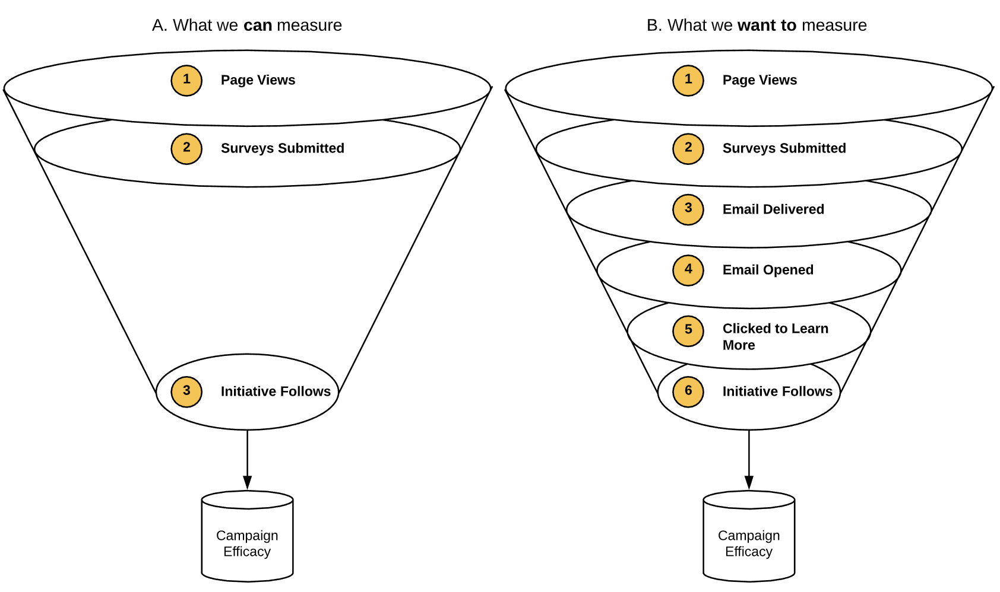
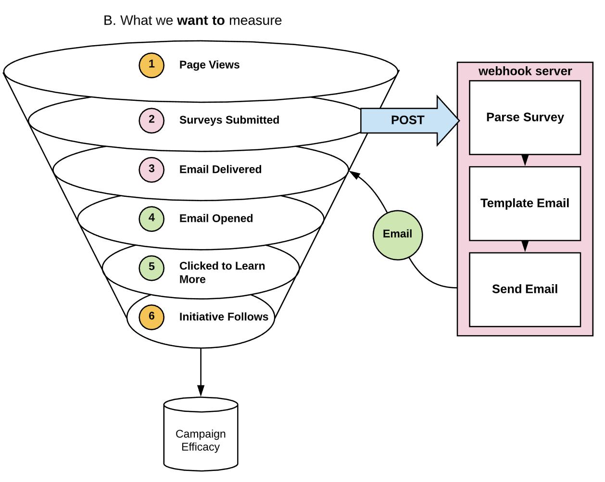
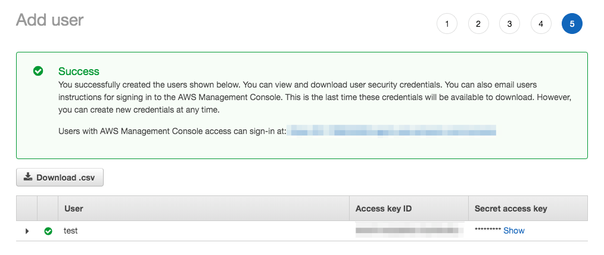
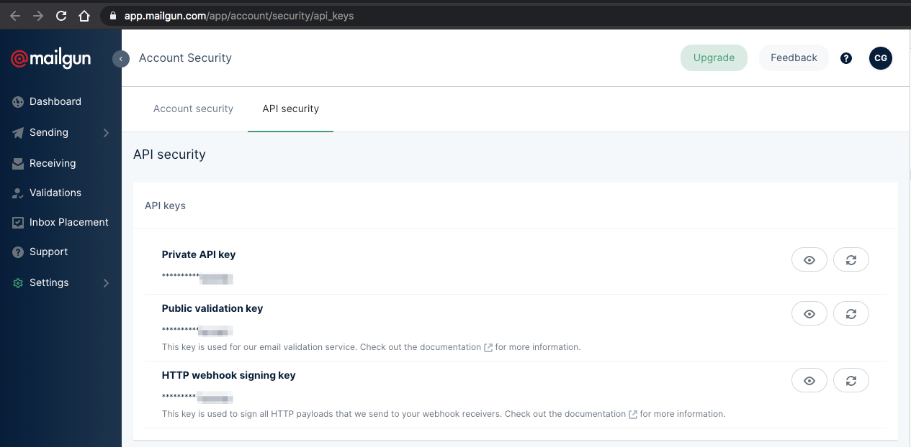
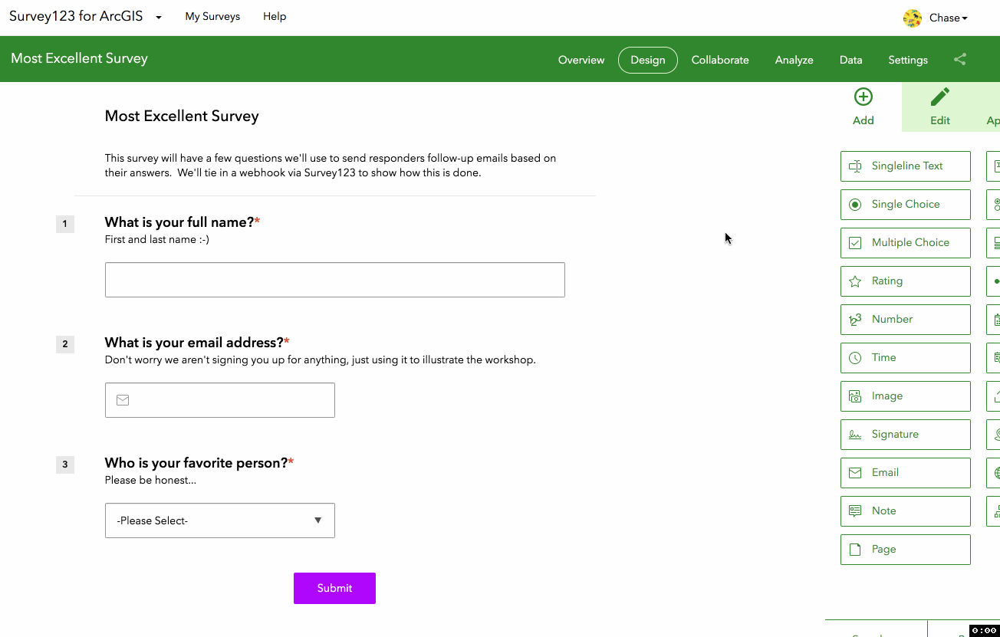
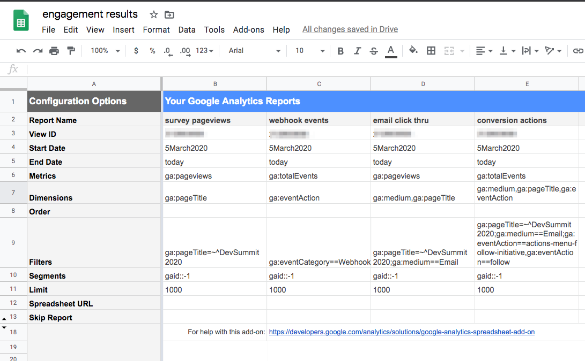
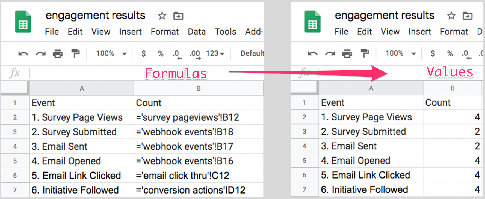
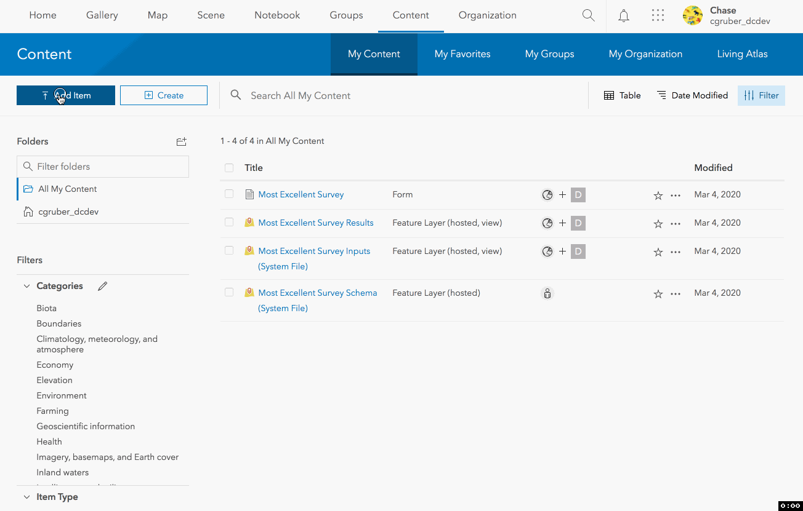
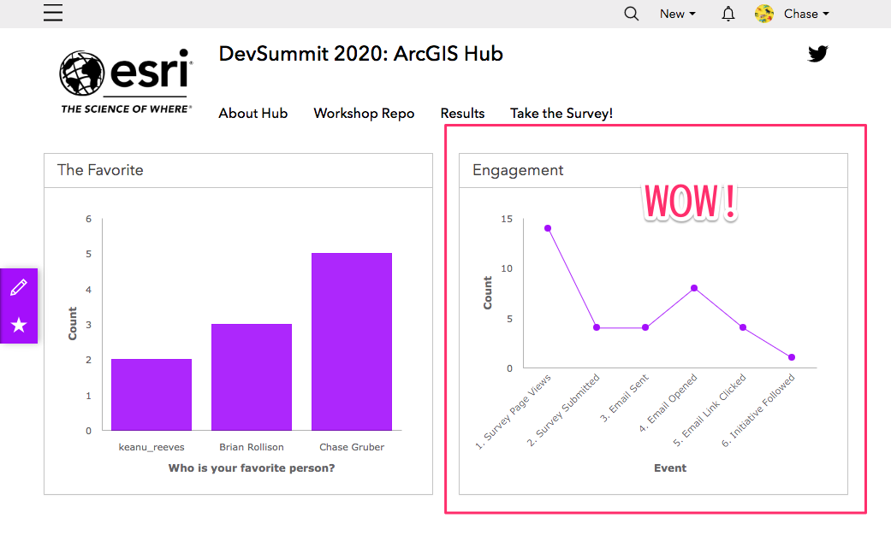

# Solving the "Effective Engagement" Problem

## Challenge
We’ve been charged with driving sign-ups/follows for a particular Hub Initiative.  The communications department is targeting audiences interested in 3 general topics of the Initiative.  We must use ArcGIS assets, but can leverage our own implementation to elicit maximum success.

### Targeted User Flow
Engagement can be thought of as a "funnel" in form. Most broadly, there is general traffic on a site. As users interact with sites, with some subtle prodding they move further down the funnel toward the goal of a campaign, in our case to sign up and follow. However, the funnel is not perfect. It has holes and leaks. At any point in the flow users can _disengage_. Attrition occurs at every step in the funnel as it is highly unlikely that all users will behave as we want. At the end of the funnel is the conversion point, where we can say that a user starting at point A found themselves at point B and not by coincidence. The targeted user flow, or funnel, for our scenario is described below.

1. User clicks to view Hub Page with Survey123 App embedded
1. User submits response to survey on Hub Page
1. User gets follow-on thank you email with link to expressed interest
1. User opens interest Hub Page from email
1. User signs-in/-up to ArcGIS Hub
1. User selects to follow Hub Initiative

### Measuring Engagement
Quantifying the effectiveness of our campaign requires objective measures. Each step in our user flow can be described as a measurable dimension. We would expect values of these measures to be downward trending, meaning that there should be far more page views on the survey page than survey submissions than conversion actions.

1. [entry] Page views on survey page
1. Survey submissions
1. Follow-on emails sent
1. Emails opened
1. Email links clicked (navigate to interest Hub Page)
1. [conversion] Hub Initiative follow actions (referred by follow-on email)

### What do we get "for free"?
ArcGIS Hub collects user interaction events (such as page views and button clicks), which can be accessed by configuring a Hub Initiative with Google Analytics (described later). This would generate insights to metrics 1 and 6 above. Results from our Survey would indicate the reach of the survey component, but is logged separately from Hub's Google Analytics. To summarize, out of the box we can most easily measure visits to the survey page and follow actions, while the middle steps in the engagement flow are not readily apparent.



## Solution
Survey123 has an option to configure a webhook event on survey submissions. The webhook sends a POST request to the provided endpoint with a payload containing information about the record submitted, the survey's portal org, and the user (if authenticated). Any flavor REST web service can be at the receiving end of the webhook. Sending follow up emails is a common use case, which we will execute as part of our solution. Aside from simply sending email, our solution will enable us to capture additional engagement analytics along the way which will fill in the gaps of the funnel image above.

The webhook endpoint can log interaction events to the same store as our site's page views and events. From this server we can add an event for surveys submissions. The server component will also send emails, and log emails sent as an event. The body of the follow-on emails can be used to track engagement, and encourage movement down the funnel. Emails are embedded with a [tracking pixel](https://developers.google.com/analytics/devguides/collection/protocol/v1/email), which is commonly used to measure email open rates. Depending on the answers encoded in a response, we can refer survey respondents to pages that correspond to their interests, which might increase the chance that they choose to follow the initiative. If a respondent is already a Hub user, we can further tailor the email body to their relationship with the initiative. The links to the interest pages will have include [campaign parameters](https://support.google.com/analytics/answer/1037445?hl=en&ref_topic=1032998), which enable us to discern that the links in the emails were clicked and that subsequent actions (follow initiative) are related to those referrals.



The addition of this server component completes our funnel. We are now able to log additional events to our site's Google Analytics, enabling us to more effectively gauge the efficacy of our campaign to drive engagement with our Hub Initiative. You can experiment with this implementation by following the tutorial below.

# Tutorial

> Disclaimer: this solution is entirely proof-of-concept and not guaranteed to be suitable for production use cases.

## Requirements
- Hub Initiative
- Survey123 Survey
- Google Analytics & Google Sheets
- AWS account
- [Serverless framework](https://serverless.com)
- email client (this demo uses [Mailgun](https://mailgun.com))

## Hub Initiative setup
Our Hub Initiative is both the launch pad and landing zone for this exercise. Ultimately, we want to analyze how an engaged visitor (survey respondent) to our Hub Initiative can be influenced to perform some behavior (follow the initiative). To do this we need to create and configure some assets, outlined in the steps below:

### 1. [Create a Hub Initiative](https://doc.arcgis.com/en/hub/initiatives/initiative-basics.htm)
- Record the Initiative's item id (easiest way is by [navigating to the Initiative item at arcgis.com](assets/readme/initiative-id.gif))

### 2. [Add Google Analytics](https://doc.arcgis.com/en/hub/sites/configure-site-settings.htm#ESRI_SECTION1_564FACD5005D4F0A9F3D0F42A0E038FD) to Hub Initiative site
### 3. [Create a survey in Hub](https://www.esri.com/arcgis-blog/products/arcgis-hub/constituent-engagement/introducing-surveys-in-arcgis-hub/) (or Survey123)
### 4. [Add survey to Hub Initiative site](https://doc.arcgis.com/en/hub/sites/share-a-survey.htm#ESRI_SECTION1_7C38232DC8E44E898D9B355656BC57BE)

## Serverless Framework setup
[Serverless](https://serverless.com) is a framework used to develop and deploy applications to cloud services (AWS, Microsoft Azure, Google Cloud Platform, etc). It provides a simple YAML configuration which, in this example, tells AWS CloudFormation to create and stitch together the resources needed to execute this proof of concept. Specifically, it creates an API Gateway POST endpoint which invokes a Lambda function.

### 1. Install [Serverless](https://serverless.com/framework/docs/getting-started#installing-via-npm)
```
$ npm install -g serverless
```

### 2. Create AWS user for Serverless
This user should be granted programmatic access, and you can specify policies and roles as you like (for the sake of getting up to speed quickly, I assigned my user the administrator role). Upon creation, AWS should supply a key and secret for this user, as shown below



### 3. Provide AWS credentials to Serverless
This enables Serverless to generate the CloudFormation application blueprint described in [serverless.yml](serverless.yml).
```
$ serverless config credentials --provider aws --key <KEY> --secret <SECRET>
```

## Mailgun setup
[Mailgun](https://mailgun.com) is a cloud email service with a developer-friendly API (you may choose to integrate with another webmail provider or CRM to manage email transactions). In this exercise, we are only using it to programmatically send emails from our cloud function.

Create an account or log in. [Register a domain for the Mailgun API](https://help.mailgun.com/hc/en-us/articles/202464990-How-Do-I-Start-Sending-Email-). Once your domain is successfully registered, you should be able to [find your Mailgun API keys](https://app.mailgun.com/app/account/security/api_keys). The `Private API Key` value to the environment config described in the next step.



## Run the program
This program is designed to be run with minimal configuration with the steps outlined below:

### 1. Install dependencies with `npm install`
### 2. Supply environment variables to `config/env.<stage>.json`
Your environment file should match the structure of [dummy env file](config/env.dummy.json) using your specified values for Google Analytics tracking code, Mailgun API keys and variables, and Hub Initiative id and url. The default stage for this program is `dev`, so without changing anything else you must have a file called `config/env.dev.json` to run this code. **Do not commit your environment files.**
### 3. Deploy the Serverless application
`serverless deploy` will [generate resources in your AWS cloud](assets/readme/resources.png) and output to your console something like:
```
$ serverless deploy
Serverless: Packaging service...
Serverless: Excluding development dependencies...
Serverless: Uploading CloudFormation file to S3...
Serverless: Uploading artifacts...
Serverless: Uploading service hub-engagement.zip file to S3 (4.96 MB)...
Serverless: Validating template...
Serverless: Updating Stack...
Serverless: Checking Stack update progress...
..............
Serverless: Stack update finished...
Service Information
service: hub-engagement
stage: dev
region: us-east-1
stack: hub-engagement-dev
resources: 12
api keys:
  None
endpoints:
  POST - https://xxxxxxxxxx.execute-api.us-east-1.amazonaws.com/dev/webhook
functions:
  survey123WebhookListener: hub-engagement-dev-survey123WebhookListener
layers:
  None
Serverless: Removing old service artifacts from S3...
Serverless: Run the "serverless" command to setup monitoring, troubleshooting and testing.
```
**Make note of the POST endpoint for the next step.**

## Add API endpoint to Survey123 Webhook
At this point, we have a Hub Initiative, a survey, a POST endpoint, and a cloud function. Google Analytics is collecting page views from our Initiative and will collect synthetic events from our cloud function, so the next step is to close the feedback loop by connecting the survey's webhook to the cloud function. Using the aforementioned POST endpoint, configure a webhook for the survey in Survey123 settings (you can [navigate there from Hub](assets/readme/hub-survey-settings.png) by clicking `Settings` in your survey editor). Click `Add Webhook`, provide your endpoint url, and check the boxes to include whatever event data you need (all data were marked in this exercise, but not all were required).



## Reporting
Our feedback loop is now complete, and we should be collecting analytics from both site traffic and our webhook. Users who complete our survey should receive emails which they may or may not open, and the emails contain links which they may or may not click, and when clicked users may or may not follow our initiative. To report these analytics back to our Hub Initiative site, we configured a customized Google Analytics report in a Google Sheet, which is uploaded to ArcGIS Online as a Hosted Table and displayed as a Chart Card in our site. A rough outline of these steps is listed below:

### 1. In Google Sheets, [install the Google Analytics Addon](https://developers.google.com/analytics/solutions/google-analytics-spreadsheet-add-on)

This addon enables Google Analytics to run reports and write their results in a Google Sheet. The addon offers various [configurations and filters](https://developers.google.com/analytics/solutions/google-analytics-spreadsheet-add-on#optional-parameters), which are useful to distill an entire suite of analytics to the events and pageviews that pertain to this exercise.

### 2. Configure and run reports
For simplicity's sake, I generated four separate reports that are coalesced in a single view representative of our "funnel". The four reports indicate:
- count of survey views
- count of events from our cloud function (surveys submitted, emails sent, emails, opened)
- count of page views driven by email links
- count of "initiative follow" events related to these page views

The report configuration options are shown below.



Run the reports by clicking `Add-ons` -> `Google Analytics` -> `Run Reports`. This will create a sheet for each report. You can also [schedule  reports to run automatically](assets/readme/ga-sheets-schedule.png) to keep your data most up to date.

### 3. Coalesce reports into another sheet
The last step is to take the output of the reports and combine them in a single view. A simple way to do this is by [referencing cells from the report sheets](https://support.google.com/docs/answer/75943?co=GENIE.Platform%3DDesktop&hl=en) in this new sheet (assuming the structure of the reports remains consistent). This way you can control the order the data are reported, so it makes logical sense in terms of the conversion funnel.



### 4. Upload to ArcGIS Online
Back in ArcGIS Online, we can add this sheet to our content as a Hosted Table. Add an item from a cloud drive and complete OAuth with your Google account. Filter to your Google Sheet made in the previous steps, and publish the sheet that contains the coalesced report.



### 5. Add report to Hub Initiative site
Navigate to the site editor for your Initiative site and [add your report as a chart card](https://doc.arcgis.com/en/hub/sites/insert-charts-tables-and-key-metrics.htm) in the layout. Now you can observe the efficacy of your Hub Initiative _in your Hub Initiative_!


